User Interface
==============

Spatial
-------

Load data for Points of Interest (POI)
~~~~~~~~~~~~~~~~~~~~~~~~~~~~~~~~~~~~~~

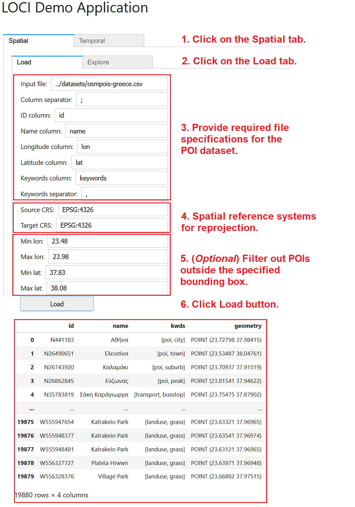

To load a POI dataset, (1) navigate to the **Spatial** tab. Then, (2) click on the **Load** tab and provide the various specifications for the POI data (CSV files accepted only). These specifications concern (3) the path to the file, the column delimiter, the necessary columns, and the separator used in the keywords column. Also, please specify (4) the spatial reference system (sourcesCRS) of the original file and the reference system (targetCRS) where the data should be transformed into. You may optionally specify (5) a bounding box to filter the input data and only use POIs contained in this box for exploration and mining. Finally, (6) click on the **Load** button to read the POI data in main memory; once loading is complete, indicative records will be displayed. 

Explore Points
~~~~~~~~~~~~~~

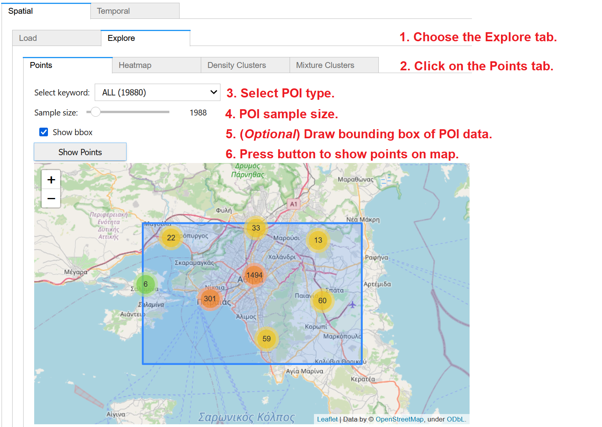

To visualize the previously loaded POI data on map, (1) choose the **Explore** tab within the **Spatial** panel and then (2) click on the **Points** tab. From the dropdown menu, (3) you may select to visualize all POIs or only those of a specific type, as extracted from the keywords column in the dataset. (4) Through the slider, you may specify the size of randomly chosen *sample* of the data for visualization; for large datasets, you may specify small samples for faster map rendering. (5) You may *optionally* check on **Show bbox**, in order to also visualize the bounding box of the POI dataset. Finally, (6) press **Show Points** to display the POIs as point clusters over an interactive OpenStreetMap backdrop. Once you pan and zoom in the map, you may see more details of the POI locations. 

Explore Heatmaps
~~~~~~~~~~~~~~~~

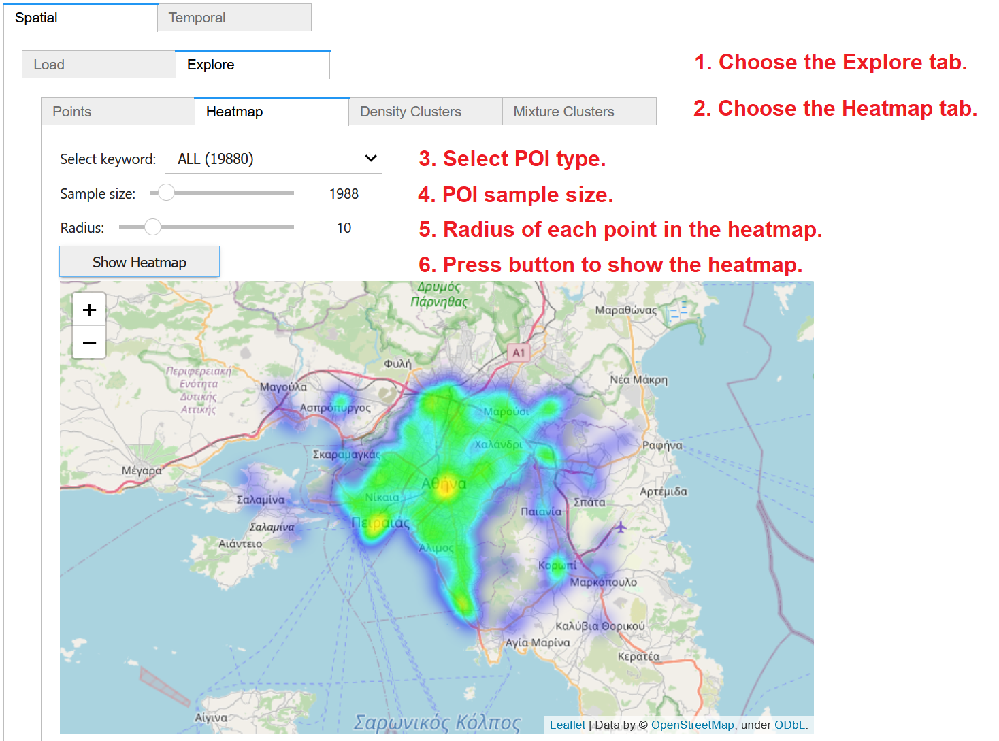

To create a heatmap of the previously loaded POI data on map, (1) choose the **Explore** tab within the **Spatial** panel and then (2) click on the **Heatmap** tab. From the dropdown menu, (3) you may select to visualize all POIs or only those of a specific type, as extracted from the keywords column in the dataset. (4) Through the slider, you may specify the size of randomly chosen *sample* of the data for analysis; for large datasets, you may specify small samples for faster processing. Also specify (5) the *radius* of influence of each point in the heatmap. Finally, (6) press **Show Heatmap** to display the created heatmap over an interactive OpenStreetMap backdrop. You may pan and zoom the map to inspect more details of the heatmap. 

Detect Density Clusters
~~~~~~~~~~~~~~~~~~~~~~~

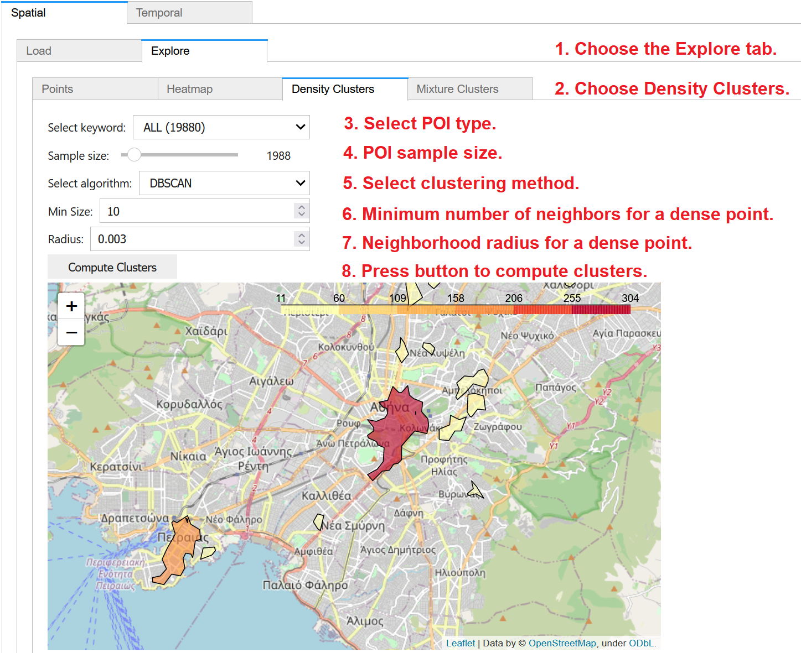

To discover density-based *clusters* of the previously loaded POI data on map, (1) choose the **Explore** tab within the **Spatial** panel and then (2) click on the **Density Clusters** tab. From the dropdown menu, (3) you may select to utilize all POIs or only those of a specific type, as extracted from the keywords column in the dataset. (4) Through the slider, you may specify the size of randomly chosen sample of the data to be used in clustering; for large datasets, you may specify small samples for faster calculation. Then, you may choose (5) the density based clustering method (DBSCAN or HDBSCAN) to apply. Density-based clustering also requires values for two other parameters: (6) the minimum number of neighboring points for a core (dense) point in the cluster; and (7) the neighborhood radius. Finally, (8) press the button to **Compute Clusters** and then to display them over an interactive OpenStreetMap backdrop with degraded color depending on their density. You may pan and zoom the map to inspect more details about the detected clusters. 

Detect Mixture Patterns
~~~~~~~~~~~~~~~~~~~~~~~

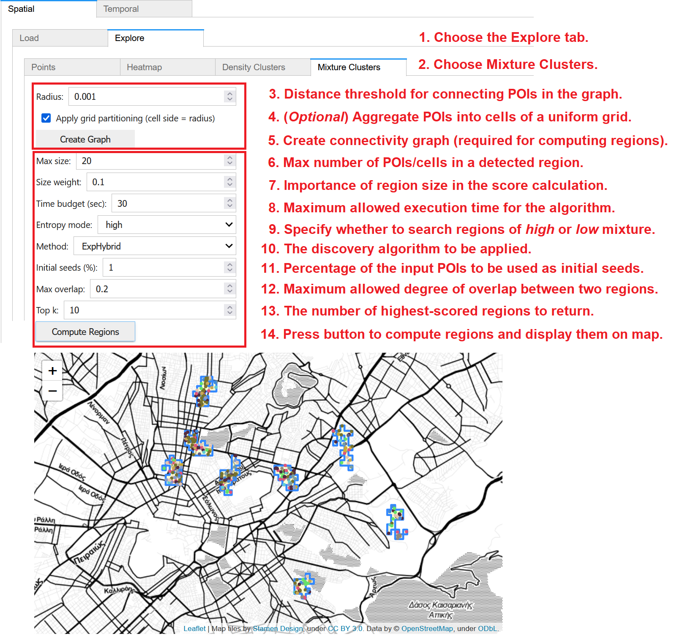

To discover regions with *high* or *low diversity* in the types of POIs therein, (1) choose the **Explore** tab within the **Spatial** panel and then (2) click on the **Mixture Clusters** tab. This computation involves two stages:

* *Preprocessing*: A connectivity graph must be constructed before any discovery. (3) This is done according to a given *radius*; pairs of POIs within this distance threshold are connected with an edge in the graph. (4) *Optionally*, for faster discovery over large datasets, POIs may be aggregated into cells; check on **Apply grid partitioning**  to use a uniform grid where the specified radius is the cell size. (5) Press **Create Graph** to construct the graph. As long as these preprocessing parameters remain unchanged, the graph need not be reconstructed and may be used for discovery of mixture clusters under any user-specified settings.
* *Discovery*: Once the graph is constructed, you must specify several parameters concerning the method for discovering mixture clusters. These include: (6) the maximum size of a region, i.e., the maximum number of points (or cells, in case grid *partitioning* was checked and applied during preprocessing) within each region; (7) A size weight denoting the importance of region size in the score calculation; (8) A *time* budget, i.e., the maximum allowed execution time for the algorithm; (9) The entropy mode, i.e., whether you wish to search for regions of high or low mixture; (10) The *discovery algorithm* to apply; from the dropdown, you may choose one of *ExpAll, ExpSingle, ExpHybrid, or ExpCircles*; (11) The percentage (%) of the initial POIs to be used as *initial seeds* for the discovery; (12) The maximum allowed degree of *overlap* between two regions; and (13) the number k of regions regions with the highest scores to be returned. Finally, (14) press **Compute Regions** to trigger the discovery process; results should be returned within the specified time budget and will be visualized on map.

Temporal
--------

Single Time Series
~~~~~~~~~~~~~~~~~~

Load Data
"""""""""

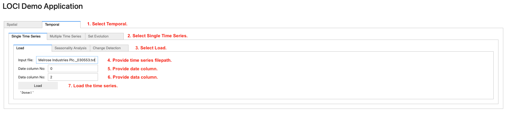

To load a single time series, navigate to the **Temporal** (step 1) tab. Then, on the **Single Time Series** (step 2) tab, navigate to the **Load** (step 3) tab and provide (i) the path to the file containing the time series (step 4), (ii) the date column (step 5) and (iii) the data column (step 6). Finally, click on the Load button (step 7) to load the time series in main memory.

Seasonal decomposition
""""""""""""""""""""""

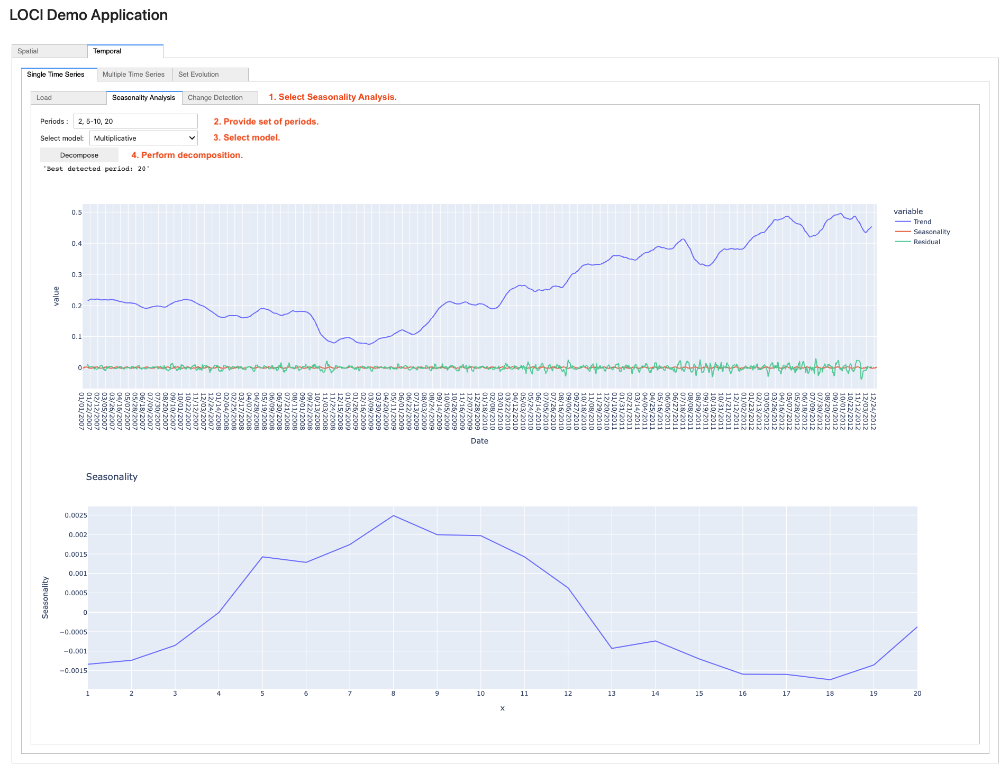

To perform seasonal decomposition on a loaded time series, navigate to the **Seasonality Analysis** sub-tab (step 1). Then, enter the set of periods to be tested in the **Periods** field (step 2, can be separated by a comma, or a hyphen, indicating a range of periods, e.g., 5-10). Next, select the model (step 3) and click on the **Decompose** button (step 4). Finally, the returned trend-seasonality-residuals and seasonality graphs are rendered.

Change Detection
""""""""""""""""

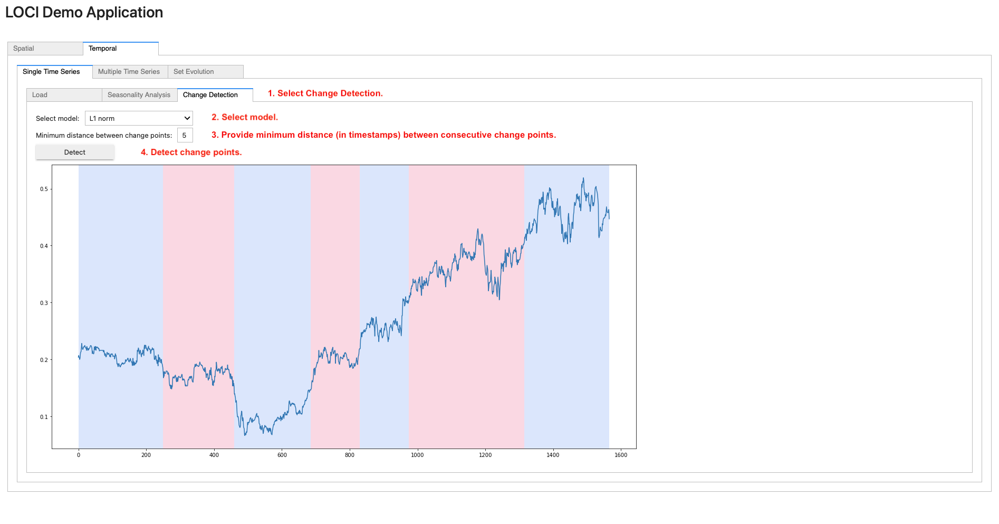

To apply change detection on a loaded time series, navigate to the **Change Detection** sub-tab (step 1). Then, select a model from the corresponding drop-down list (step 2) and the minimum desired distance (in number of timestamps) between consecutive change points (step 3). Finally, click on the **Detect** button (step 4); the graph containing the change points (i.e., on timestamps where the color changes) is rendered.

Multiple Time Series
~~~~~~~~~~~~~~~~~~~~

Load Data
"""""""""

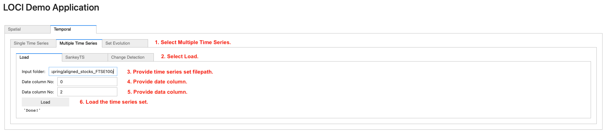

To load multiple time series, navigate to the **Temporal** tab. Then, on the **Multiple Time Series** (step 1) tab, navigate to the **Load** (step 2) tab and provide (i) the path to the folder containing the time series files (step 3), (ii) the date column (step 4) and (iii) the data column (step 5). Finally, click on the Load button (step 6) to load the time series set in main memory.

Sankey TS
"""""""""

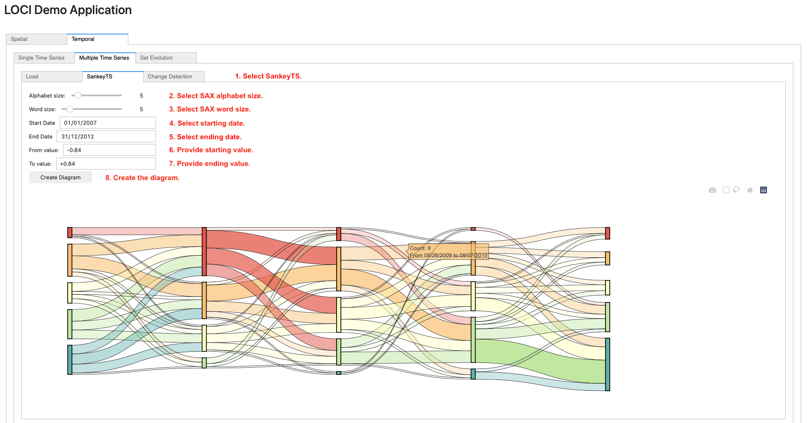

To generate a **Sankey TS** diagram on a loaded set of time series, navigate to the SankeyTS sub-tab (step 1). Then, select the SAX alphabet and word size using the sliders (step 2 and step 3) and select the starting/ending dates using the date picker widgets (step 4 and step 5). Next, provide the lower/upper value axis bounds (step 6 and step 7) for which the diagram will be generated. Finally, click on the **Create Diagram** (step 8) button.

Change Detection
""""""""""""""""

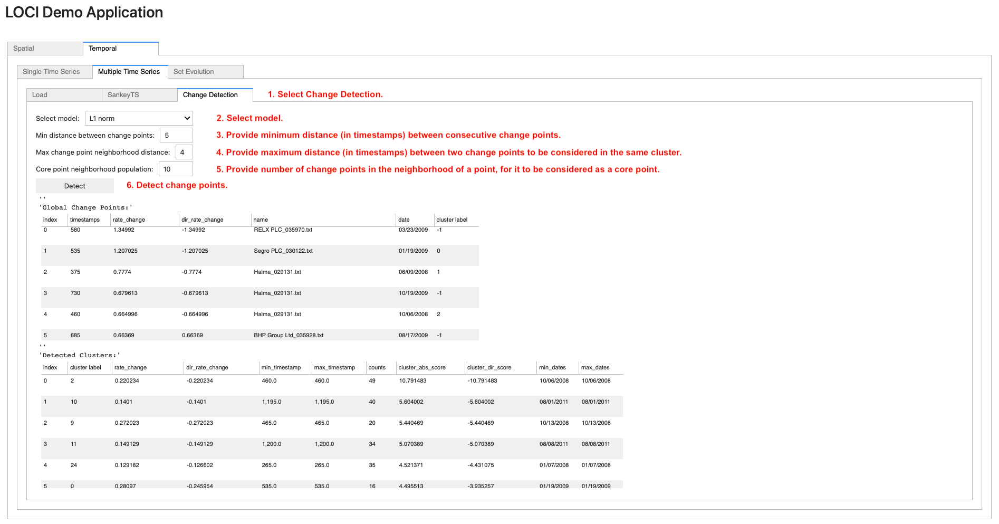

To apply change detection on a loaded set of time series, navigate to the **Change Detection** sub-tab (step 1). Then, select a model from the corresponding drop-down list (step 2), the minimum distance (in number of timestamps) between change points (step 3), the maximum distance (in number of timestamps) between two change points to be considered in the same cluster (step 4) and the number of change points in the neighborhood of a point, for it to be considered as a core point (step 5). Finally, click on the **Detect** button (step 6); this renders two scrollable data frames, containing the detected global change points and corresponding clusters.

Set Evolution
~~~~~~~~~~~~~

Load Data
"""""""""

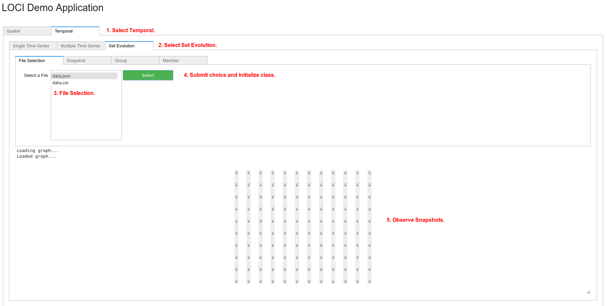

To load data for Set Evolution, choose tab **Temporal** (step 1) and then choose tab **Set Evolution** (step 2). The user can select which file to use (step 3). The corresponding files are in /datasets/evolving_sets/data/. Only files ending with .csv and .json are listed, since Change_Detector can only read these formats. Press Choose (step 4) to read file and initialize Change_Detector. Finally, observe the initial snapshots (step 5). Use the mouse wheel to zoom-in and -out or click the left-button to navigate.

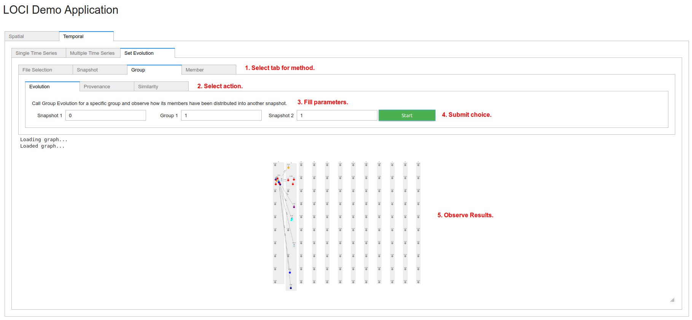

To perform analysis, select the appropriate tab (step 1), based on the corresponding methods: **Snapshot**, **Group** or **Member**. Select an inner tab (step 2) for the corresponding action: Snapshot -> (**Evolution**, **Similarity**), Group -> (**Evolution**, **Provenance**, **Similarity**), Member -> (**Evolution**, **Rules**, **Co-members**). More information on each action can be found here :class:`.Change_Detector`. Fill the corresponding parameters of each action (step 3). More information can be found here :class:`.Change_Detector`. Submit choice (step 4). Finally, observe the results in the graph (step 5). Depending on the action, there might be edges or colors in nodes or a dataframe for member rules.